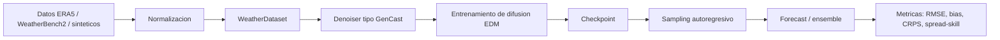
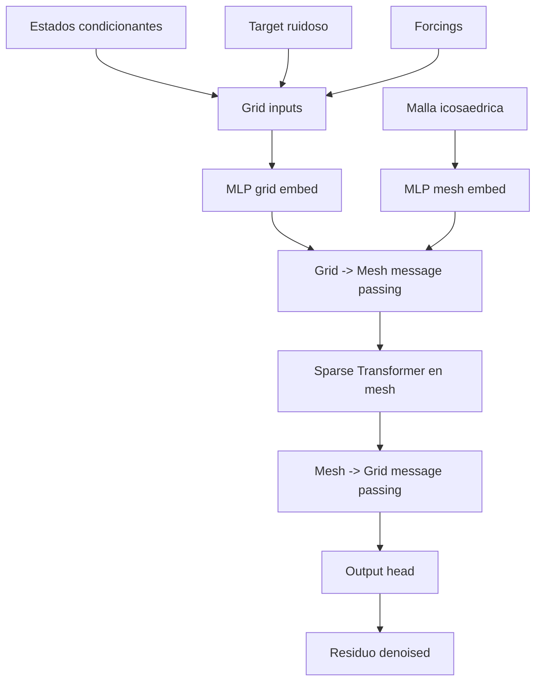

# Guia explicativa del repositorio GenCast Repro

## 1. Resumen ejecutivo

Este repositorio implementa una version publica, entrenable y autocontenida en
PyTorch de un modelo de pronostico meteorologico probabilistico inspirado en
GenCast.

La idea central es aprender una distribucion de posibles estados futuros de la
atmosfera. En vez de producir un unico pronostico determinista, el modelo genera
un ensemble: varias trayectorias plausibles. Eso permite estimar no solo el
estado esperado, sino tambien la incertidumbre del pronostico.

El proyecto incluye:

- carga de datos meteorologicos desde ERA5 o WeatherBench2 en `zarr`, NetCDF o
  multi-file NetCDF;
- generacion de un dataset sintetico para pruebas rapidas;
- normalizacion de variables meteorologicas, residuos y forcings;
- arquitectura tipo GenCast con grilla global, malla icosaedrica y processor
  sparse-transformer;
- entrenamiento de un denoiser de difusion con preacondicionamiento EDM/Karras;
- sampling autoregresivo para generar rollouts;
- evaluacion con metricas meteorologicas y probabilisticas;
- tests de humo para validar configuracion, geometria y forward pass del modelo.

Importante: este repo no contiene los pesos propietarios de DeepMind ni busca
ser una copia bit a bit del sistema interno de Google. Es una base de
investigacion reproducible que replica los componentes publicos principales de
un predictor estilo GenCast.

## 2. Que es GenCast

GenCast es una familia de modelos de pronostico meteorologico de mediano plazo
basada en difusion generativa. Su proposito es modelar multiples futuros
atmosfericos posibles condicionados en estados recientes de la atmosfera.

En terminos simples:

1. Se toma informacion meteorologica reciente.
2. Se condiciona el modelo con variables temporales y geograficas.
3. Se predice el cambio esperado hacia el siguiente estado atmosferico.
4. Ese cambio se genera mediante un proceso de denoising probabilistico.
5. El proceso se repite autoregresivamente para avanzar varias ventanas de
   tiempo.
6. Al samplear varias veces, se obtiene un ensemble de pronosticos.

La ventaja de este enfoque es que el pronostico no queda reducido a una unica
respuesta. En meteorologia, la incertidumbre importa: dos escenarios pueden ser
fisicamente plausibles, y un buen sistema debe poder reflejar esa dispersion.

## 3. Que hace este repositorio

Este repositorio, `gencast-repro`, arma una version reducida pero completa del
pipeline:



El objetivo practico es que una persona pueda:

- entrenar rapidamente el modelo en modo `mini` con datos sinteticos;
- adaptar las configs para correr con ERA5 real;
- estudiar como se conectan grilla, malla, difusion y metricas;
- extender la arquitectura o el entrenamiento sin depender de codigo cerrado.

## 4. Estructura del repositorio

La estructura principal es:

```text
.
|-- README.md
|-- GUIA_GENCast.md
|-- pyproject.toml
|-- configs/
|   |-- mini.yaml
|   |-- era5_1deg.yaml
|   `-- era5_0p25deg.yaml
|-- src/gencast_repro/
|   |-- cli.py
|   |-- config.py
|   |-- constants.py
|   |-- data/
|   |-- geometry/
|   |-- models/
|   |-- training/
|   `-- inference.py
|-- tests/
`-- artifacts/
```

### Archivos de alto nivel

- `README.md`: explicacion breve del proyecto, instalacion y comandos basicos.
- `pyproject.toml`: definicion del paquete Python, dependencias y comando CLI
  `gencast-repro`.
- `configs/*.yaml`: configuraciones de experimentos.
- `artifacts/`: salidas generadas, como estadisticas, checkpoints y samples.

### Paquete principal

El codigo vive en `src/gencast_repro`.

- `cli.py`: define los comandos de consola.
- `config.py`: carga YAMLs a dataclasses tipadas.
- `constants.py`: variables meteorologicas por defecto, niveles de presion y
  pesos por variable.
- `data/`: carga de datasets, normalizacion, layout de canales y dataset
  sintetico.
- `geometry/`: grilla global, esfera icosaedrica y conectividad grid-mesh.
- `models/`: denoiser, bloques MLP, message passing, sparse transformer y
  scheduler de difusion.
- `training/`: loop de entrenamiento, evaluacion, losses y metricas.
- `inference.py`: sampling de un paso y rollout autoregresivo.

## 5. Configuraciones incluidas

El repo trae tres configuraciones listas:

### `configs/mini.yaml`

Configuracion de humo para correr en CPU con datos sinteticos.

Caracteristicas:

- `use_synthetic_data: true`
- resolucion global de `10.0` grados;
- grilla de `19 x 36`;
- malla icosaedrica con `mesh_refinement: 2`;
- `latent_dim: 128`;
- `processor_layers: 4`;
- entrenamiento de `1` epoca;
- ensemble de evaluacion de `4` miembros;
- rollout de `4` pasos a 12 horas.

Esta configuracion no busca producir un modelo meteorologico fuerte. Sirve para
validar que todo el pipeline funciona de punta a punta.

### `configs/era5_1deg.yaml`

Configuracion razonable para una replica con datos reales a 1 grado.

Caracteristicas:

- `use_synthetic_data: false`
- fuente esperada en `/path/to/era5.zarr`;
- train: 1979-01-01 a 2017-12-31;
- valid: 2018-01-01 a 2018-12-31;
- test: 2019-01-01 a 2019-12-31;
- `mesh_refinement: 4`;
- `latent_dim: 256`;
- `processor_layers: 8`;
- `num_sampling_steps: 20`;
- entrenamiento en `cuda`.

Esta config ya asume hardware con GPU y datos meteorologicos reales preparados.

### `configs/era5_0p25deg.yaml`

Configuracion mas ambiciosa, cercana al espiritu del paper.

Caracteristicas:

- resolucion `0.25` grados;
- `mesh_refinement: 5`;
- `latent_dim: 384`;
- `processor_layers: 12`;
- ensemble de `16` miembros;
- batch size `1`;
- entrenamiento en `cuda`.

Esta version requiere hardware serio y un dataset ERA5/WeatherBench2 completo.

## 6. Variables meteorologicas

Por defecto el layout de canales usa variables de superficie, variables
atmosfericas en niveles de presion, forcings temporales y variables estaticas.

### Variables de superficie

- `2m_temperature`
- `mean_sea_level_pressure`
- `10m_v_component_of_wind`
- `10m_u_component_of_wind`
- `total_precipitation_12hr`
- `sea_surface_temperature`

### Variables atmosfericas

Para cada nivel de presion se cargan:

- `temperature`
- `geopotential`
- `u_component_of_wind`
- `v_component_of_wind`
- `vertical_velocity`
- `specific_humidity`

Los niveles de presion por defecto son:

```text
50, 100, 150, 200, 250, 300, 400, 500, 600, 700, 850, 925, 1000 hPa
```

Con 6 variables atmosfericas y 13 niveles, eso aporta `78` canales. Sumados a
los 6 canales de superficie, el estado fisico tiene `84` canales.

### Forcings y campos estaticos

El modelo tambien recibe variables que no son el estado atmosferico directo:

- `year_progress_sin`
- `year_progress_cos`
- `day_progress_sin`
- `day_progress_cos`
- `geopotential_at_surface`
- `land_sea_mask`

Estas variables ayudan al modelo a saber donde y cuando esta prediciendo.

## 7. Como se construye un ejemplo de entrenamiento

La clase `WeatherDataset` arma muestras con tres tiempos:

```text
t0: estado previo
t1: estado actual
t2: estado objetivo
```

En la configuracion mini, los datos nativos tienen paso de 6 horas y el modelo
predice a 12 horas. Por eso se usa un gap de 2 timestamps:

```text
previous_state = t
current_state  = t + 12h
target_state   = t + 24h
```

El modelo no aprende directamente el estado absoluto futuro para la mayoria de
los canales. Aprende el residuo:

```text
residual = target_state - current_state
```

Para precipitacion acumulada, el tratamiento es especial:

```text
residual_precipitation = target_precipitation
```

Esto evita interpretar precipitacion acumulada como una diferencia de estado
instantaneo. En el rollout, la precipitacion predicha se reemplaza por el valor
sampleado directamente.

Cada muestra devuelve:

- `conditioning`: dos estados normalizados, con shape
  `[input_steps, channels, lat, lon]`;
- `forcings`: forcings normalizados para el tiempo objetivo;
- `target`: residuo normalizado;
- `current_state`: estado fisico actual;
- `target_state`: estado fisico real usado para evaluar;
- `latitudes`, `longitudes`;
- `input_time`, `target_time`.

## 8. Normalizacion

El comando `fit-normalizer` calcula estadisticas sobre el split de entrenamiento.

Se guardan:

- media y desviacion estandar de estados;
- media y desviacion estandar de residuos;
- media y desviacion estandar de forcings;
- nombres de canales de estado;
- nombres de canales de forcing.

El archivo se guarda como `.npz`, por ejemplo:

```text
artifacts/stats_mini.npz
```

La normalizacion es importante porque las variables tienen escalas muy
distintas. Temperatura, presion, viento, humedad y geopotencial no viven en el
mismo rango numerico. Entrenar sin normalizar haria que algunas variables dominen
la loss solo por escala.

## 9. Arquitectura del modelo

El modelo principal es `GenCastDenoiser`.

Su estructura conceptual es:



### Entradas del core

El core recibe:

- dos estados pasados normalizados;
- el target ruidoso de la difusion;
- forcings normalizados;
- posicion geografica de cada punto de grilla;
- embedding de ruido `sigma`.

La dimension de entrada por nodo de grilla es:

```text
input_steps * state_channels
+ state_channels
+ forcing_channels
+ 5 posiciones/geometria
```

Las 5 features geometricas son:

- `x`, `y`, `z` en esfera unitaria;
- latitud escalada;
- longitud escalada.

### Grid -> mesh

Los datos meteorologicos viven naturalmente en una grilla lat/lon. Pero el
processor trabaja sobre una malla icosaedrica, que evita varios problemas de
geometria cerca de los polos.

El bloque `BipartiteGraphBlock` manda mensajes desde nodos de grilla hacia nodos
de la malla usando vecinos cercanos. Las aristas tienen features geometricas:

- latitud del sender;
- latitud del receiver;
- delta latitud;
- delta longitud;
- distancia 3D.

### Processor sparse-transformer

El processor es un `SparseTransformer`.

En vez de atencion global completa sobre todos los nodos, usa vecinos de hasta
`attention_k_hop` saltos sobre la malla. Esto mantiene la estructura espacial y
reduce el costo computacional frente a una atencion densa.

Cada bloque usa:

- self-attention local por vecindario;
- feed-forward MLP;
- normalizacion adaptativa condicionada en el embedding de ruido.

### Mesh -> grid

Despues del procesamiento sobre la malla, se devuelven mensajes hacia la grilla
original lat/lon. Finalmente, un MLP proyecta cada nodo de grilla a los `84`
canales del residuo atmosferico.

## 10. Difusion EDM/Karras

El entrenamiento usa un modelo de difusion condicionado.

Para cada batch:

1. Se samplea un nivel de ruido `sigma`.
2. Se genera ruido aproximadamente esferico.
3. Se suma ruido al residuo objetivo.
4. El denoiser intenta reconstruir el residuo limpio.
5. La loss se pondera por sigma, latitud y variable.

La funcion de entrenamiento central hace:

```text
noisy_target = target + noise * sigma
prediction = model(conditioning, forcings, noisy_target, sigma)
loss = weighted_mse(prediction, target)
```

El preacondicionamiento EDM usa coeficientes:

- `c_in`: escala la entrada ruidosa;
- `c_skip`: conserva parte de la entrada;
- `c_out`: escala la salida del core;
- `loss_weight`: pondera la loss segun el nivel de ruido.

Durante sampling, `EDMSampler` usa schedule de Karras desde `sigma_max` hasta
`sigma_min`, con actualizaciones tipo Euler/Heun. En las configs ERA5 se activa
`stochastic_churn`; en `mini` esta en `0.0` para que el smoke test sea mas
estable y barato.

## 11. Funcion de perdida

La loss principal es un MSE ponderado:

```text
weighted_mse = mean((prediction - target)^2 * lat_weight * channel_weight * sample_weight)
```

Donde:

- `lat_weight` pondera por area de celda usando `cos(latitud)`;
- `channel_weight` permite dar distinto peso a variables;
- `sample_weight` depende de `sigma` en el esquema EDM.

La ponderacion por latitud es clave en grillas lat/lon. Sin ella, las zonas
cercanas a los polos quedarian sobrerrepresentadas porque la grilla tiene muchos
puntos longitudinales sobre areas fisicas mas pequenas.

## 12. Entrenamiento

El comando principal es:

```bash
gencast-repro train --config configs/mini.yaml
```

El loop de entrenamiento hace:

1. Carga configuracion.
2. Crea o abre dataset.
3. Carga o calcula estadisticas de normalizacion.
4. Construye dataloaders de train, valid y test.
5. Construye `GenCastDenoiser`.
6. Optimiza con `AdamW`.
7. Aplica gradient clipping.
8. Evalua en validacion cada `valid_every` epocas.
9. Guarda `last.pt` y `best.pt`.

Los checkpoints se guardan en:

```text
artifacts/checkpoints/
```

Cada checkpoint contiene:

- `model_state_dict`;
- `optimizer_state_dict`;
- `config`.

## 13. Evaluacion

El comando es:

```bash
gencast-repro evaluate --config configs/mini.yaml --checkpoint artifacts/checkpoints/best.pt
```

La evaluacion genera varios miembros del ensemble. Para cada batch:

1. Samplea `num_ensemble_members` residuos futuros.
2. Desnormaliza los residuos.
3. Reconstruye estados fisicos.
4. Calcula la media del ensemble.
5. Compara contra `target_state`.

Metricas implementadas:

- `rmse`: error cuadratico medio con ponderacion por latitud;
- `bias`: sesgo medio con ponderacion por latitud;
- `crps`: Continuous Ranked Probability Score para ensemble;
- `spread_skill`: relacion entre dispersion del ensemble y error de la media.

Interpretacion rapida:

- menor `rmse` es mejor;
- `bias` cercano a cero indica menos sesgo sistematico;
- menor `crps` indica mejor pronostico probabilistico;
- `spread_skill` cercano a `1` suele indicar dispersion razonablemente calibrada.

## 14. Sampling y rollout autoregresivo

El comando para generar una muestra es:

```bash
gencast-repro sample \
  --config configs/mini.yaml \
  --checkpoint artifacts/checkpoints/best.pt \
  --split test \
  --index 0
```

El rollout autoregresivo funciona asi:

1. Parte de dos estados condicionantes.
2. Predice el residuo del siguiente paso.
3. Reconstruye el siguiente estado fisico.
4. Normaliza ese estado.
5. Desplaza la ventana de condicionamiento.
6. Repite el proceso por `forecast_steps`.

La salida se guarda como `.npz`, por ejemplo:

```text
artifacts/sample_mini.npz
```

El archivo contiene:

- `forecast`: estados pronosticados;
- `target_times`: timestamps pronosticados;
- `latitudes`;
- `longitudes`;
- `channels`.

## 15. Resultados actuales del repositorio

Los artefactos actuales corresponden a la configuracion `mini`, con datos
sinteticos. Por lo tanto, deben leerse como una validacion funcional del pipeline
y no como skill meteorologico real sobre ERA5.

### Artefactos existentes

```text
artifacts/stats_mini.npz
artifacts/checkpoints/best.pt
artifacts/checkpoints/last.pt
artifacts/sample_mini.npz
```

Tamanos observados:

```text
stats_mini.npz      ~3.6 KB
sample_mini.npz     ~818 KB
best.pt             ~14 MB
last.pt             ~14 MB
```

### Estadisticas mini

El normalizador `stats_mini.npz` contiene:

```text
state_mean              shape (84,)
state_std               shape (84,)
residual_mean           shape (84,)
residual_std            shape (84,)
forcing_mean            shape (6,)
forcing_std             shape (6,)
state_channel_names     shape (84,)
forcing_channel_names   shape (6,)
```

Esto confirma que el estado fisico tiene 84 canales y los forcings tienen 6
canales.

### Checkpoint mini

El checkpoint `best.pt` corresponde a:

```text
name: gencast-mini
device: cpu
epochs: 1
latent_dim: 128
processor_layers: 4
processor_heads: 4
ffw_hidden_dim: 256
resolution: 10.0
mesh_refinement: 2
```

El estado del modelo tiene:

```text
124 tensores
1,253,924 parametros
```

### Sample mini

El archivo `sample_mini.npz` contiene:

```text
forecast      shape (4, 84, 19, 36)
target_times  shape (4,)
latitudes     shape (19,)
longitudes    shape (36,)
channels      shape (84,)
```

Los timestamps generados son:

```text
2019-01-20T00:00:00.000000000
2019-01-20T12:00:00.000000000
2019-01-21T00:00:00.000000000
2019-01-21T12:00:00.000000000
```

Es decir, el sample actual guarda un rollout de 4 pasos, cada uno separado por
12 horas.

### Metricas mini medidas

Ejecutando:

```bash
.venv/bin/gencast-repro evaluate \
  --config configs/mini.yaml \
  --checkpoint artifacts/checkpoints/best.pt
```

se obtiene:

```text
rmse=2.381171
bias=0.097310
crps=1.026305
spread_skill=1.998484
```

Lectura de estos numeros:

- el RMSE indica error medio de la media del ensemble sobre el dataset sintetico;
- el bias esta relativamente cerca de cero para esta prueba;
- el CRPS resume calidad probabilistica del ensemble;
- el spread-skill mayor que 1 indica que, en esta corrida mini, el ensemble esta
  mas disperso que el error de la media.

De nuevo: como el entrenamiento mini es de una sola epoca y sobre datos
sinteticos, estos resultados sirven para demostrar que el sistema corre, no para
afirmar skill meteorologico comparable con GenCast real.

## 16. Comandos de uso

### Crear entorno

```bash
python3 -m venv .venv
source .venv/bin/activate
pip install -e .
```

Para desarrollo:

```bash
pip install -e ".[dev]"
```

### Calcular normalizador

```bash
gencast-repro fit-normalizer --config configs/mini.yaml
```

### Entrenar

```bash
gencast-repro train --config configs/mini.yaml
```

### Evaluar

```bash
gencast-repro evaluate \
  --config configs/mini.yaml \
  --checkpoint artifacts/checkpoints/best.pt
```

### Generar sample

```bash
gencast-repro sample \
  --config configs/mini.yaml \
  --checkpoint artifacts/checkpoints/best.pt \
  --split test \
  --index 0
```

### Correr tests

```bash
pytest
```

## 17. Como adaptar a ERA5 real

Para usar datos reales hay que cambiar una config como `configs/era5_1deg.yaml`.

Los campos mas importantes son:

```yaml
use_synthetic_data: false

data:
  source: /path/to/era5.zarr
  source_format: zarr
  train_split: ["1979-01-01", "2017-12-31"]
  valid_split: ["2018-01-01", "2018-12-31"]
  test_split: ["2019-01-01", "2019-12-31"]
  stats_path: artifacts/stats_era5_1deg.npz

training:
  device: cuda
```

El dataset debe tener coordenadas compatibles:

- `time`;
- `lat` o `latitude`;
- `lon` o `longitude`;
- `level`, `isobaricInhPa` o `pressure_level` para variables atmosfericas.

El codigo estandariza algunos nombres automaticamente:

```text
latitude        -> lat
longitude       -> lon
isobaricInhPa   -> level
pressure_level  -> level
```

Tambien debe incluir las variables definidas en la config. Si el dataset usa
nombres distintos, hay dos opciones:

1. Renombrar variables en el dataset antes de abrirlo.
2. Cambiar las listas de variables en la config.

## 18. Diferencias entre esta reproduccion y GenCast de produccion

Este repositorio replica la idea y varios componentes tecnicos, pero no es el
sistema oficial.

Diferencias esperables:

- no incluye pesos entrenados por DeepMind;
- no incluye todos los detalles internos de preprocessing propietario;
- no garantiza hiperparametros exactos del paper;
- no incluye infraestructura distribuida de gran escala;
- no entrena por defecto en ERA5 global completo;
- el modo mini usa datos sinteticos, no meteorologia real.

La configuracion `era5_0p25deg.yaml` se acerca mas al escenario grande, pero
igual requiere datos, hardware, tiempo de entrenamiento y validacion mucho mas
exigentes.

## 19. Limitaciones actuales

Limitaciones practicas del estado actual:

- los resultados guardados son del modo mini sintetico;
- no hay reportes persistidos de entrenamiento por epoca, solo prints de consola
  y checkpoints;
- `evaluate` imprime metricas, pero no las guarda en un archivo JSON/CSV;
- el sample actual guarda un unico rollout, no un ensemble completo persistido;
- no hay visualizaciones incluidas para mapas o trayectorias;
- no hay tests de integracion con un dataset ERA5 real;
- no hay soporte explicito para entrenamiento distribuido multi-GPU.

Estas limitaciones son normales para una reproduccion compacta. Tambien marcan
las rutas mas claras para mejorar el proyecto.

## 20. Posibles mejoras siguientes

Mejoras recomendadas:

- guardar metricas de evaluacion en `artifacts/metrics_*.json`;
- agregar script de visualizacion para mapas por canal y timestamp;
- persistir ensembles completos, no solo rollouts de un miembro;
- agregar tests con un mini NetCDF realista;
- agregar soporte de resume desde `training.resume_path`;
- registrar curvas de entrenamiento en CSV o TensorBoard;
- documentar formato exacto esperado de ERA5/WeatherBench2;
- crear notebooks de analisis para `sample_mini.npz`;
- agregar metricas por variable y por horizonte de pronostico;
- separar mejor metricas deterministicas y probabilisticas.

## 21. Lectura rapida para una presentacion

Si hay que explicar el repo en pocas frases:

> Este proyecto es una reproduccion publica en PyTorch de un predictor
> meteorologico probabilistico inspirado en GenCast. Usa dos estados recientes de
> la atmosfera, forcings temporales y campos estaticos para generar el residuo
> del siguiente estado mediante difusion EDM. La arquitectura proyecta datos de
> una grilla lat/lon hacia una malla icosaedrica, procesa informacion con un
> sparse transformer y vuelve a la grilla para producir los canales
> meteorologicos. El repositorio incluye entrenamiento, evaluacion, sampling
> autoregresivo, metricas de ensemble y un modo sintetico mini que valida el
> pipeline completo en CPU.

## 22. Glosario breve

- `Denoiser`: red que recibe un target ruidoso y aprende a reconstruir el
  residuo limpio.
- `EDM`: framework de difusion con preacondicionamiento y schedule de ruido
  usado para estabilizar entrenamiento y sampling.
- `Ensemble`: conjunto de varios pronosticos posibles para representar
  incertidumbre.
- `Forcing`: variable externa usada para condicionar el pronostico, como hora
  del dia, progreso anual o campos estaticos.
- `Grid`: grilla regular latitud-longitud donde viven los datos meteorologicos.
- `Icosphere`: malla derivada de un icosaedro subdividido sobre la esfera.
- `Processor`: bloque central que procesa informacion sobre la malla.
- `Residual`: diferencia entre estado futuro y estado actual, salvo
  precipitacion, que se trata como valor acumulado objetivo.
- `Rollout`: secuencia autoregresiva de predicciones futuras.
- `Sparse attention`: atencion restringida a vecindarios locales para reducir
  costo computacional.
